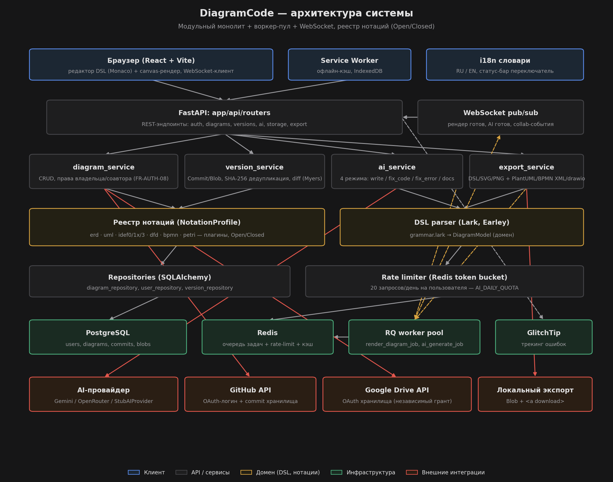
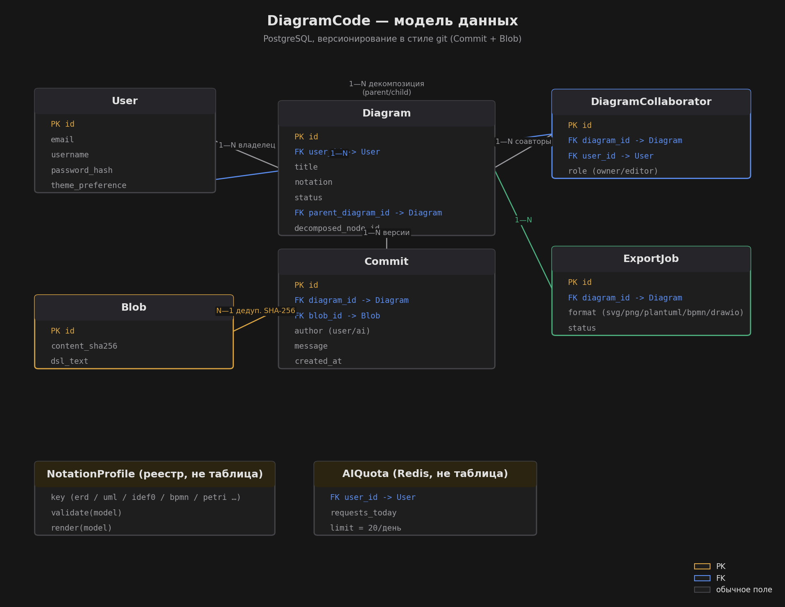

# Диаграммы архитектуры

Визуальное дополнение к `00-system-architecture.md` — то же самое словами.

## Схема системы

Слои сверху вниз: клиент (React + Vite, Service Worker, i18n) → FastAPI-роуты + WebSocket
pub/sub → сервисы (`diagram_service`, `version_service`, `ai_service`, `export_service`) →
домен (реестр нотаций + DSL-парсер) → репозитории + rate-limiter → инфраструктура
(PostgreSQL, Redis, RQ worker pool, GlitchTip) → внешние интеграции (AI-провайдер, GitHub,
Google Drive, локальный экспорт).

Пунктирные жёлтые стрелки — асинхронный путь через воркер-пул (тяжёлый рендер, AI-генерация),
не блокирующий HTTP-поток API (FR-REN-04).

## Модель данных

`User` → `Diagram` (владелец) → `Commit` → `Blob` (git-подобное версионирование с
дедупликацией по SHA-256). `DiagramCollaborator` и самоссылка `Diagram.parent_diagram_id` —
решения по открытым вопросам №1 и №2 (см. `docs/requirements/00-overview.md` §5).
`NotationProfile` и `AIQuota` — не таблицы БД: первое — реестр плагинов в памяти процесса,
второе — счётчик в Redis.
