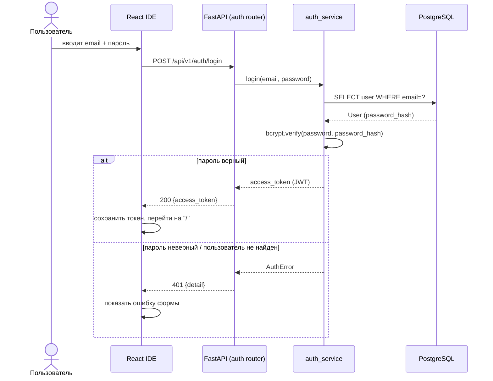
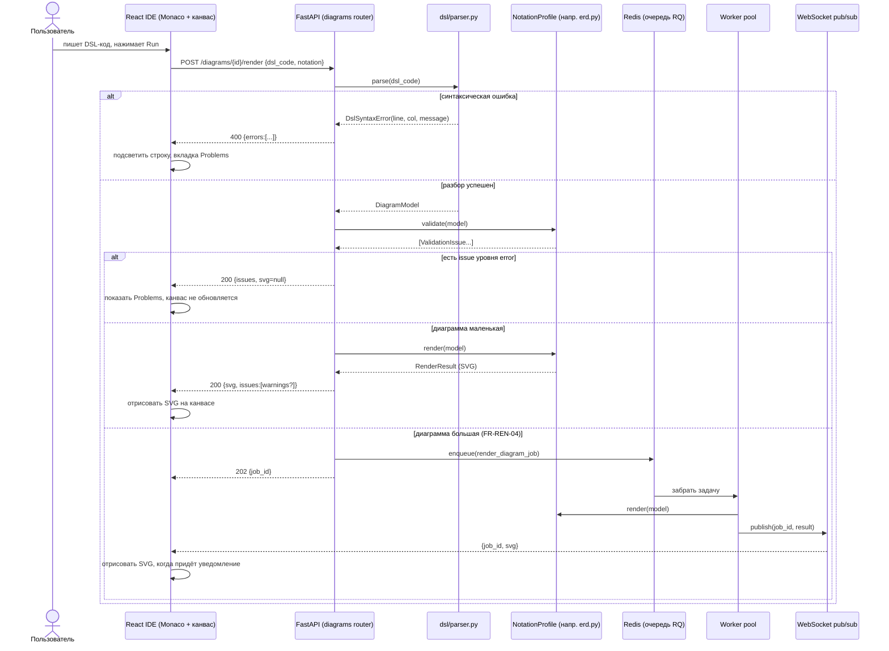
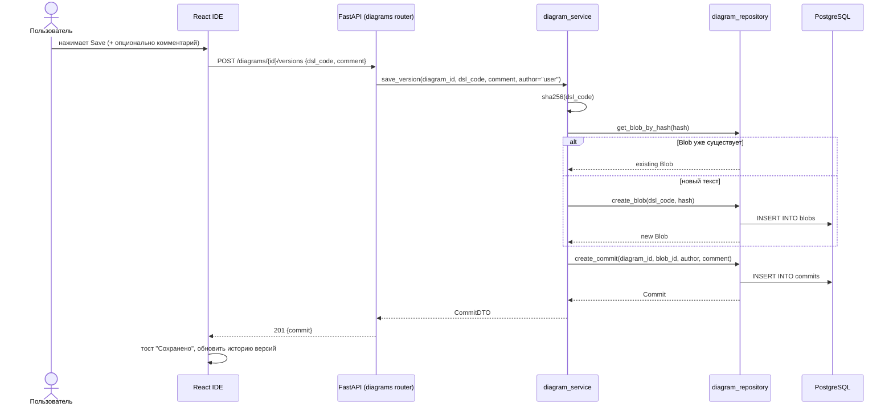
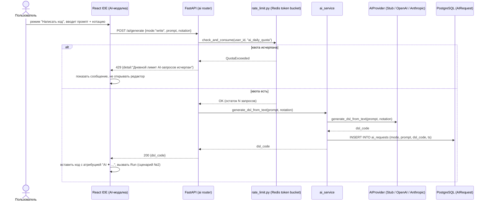
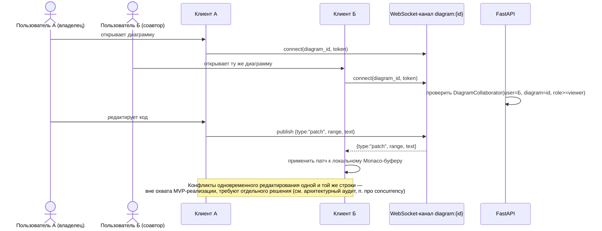

# Диаграммы последовательностей ключевых сценариев

**Статус:** актуально
**Связанные документы:** [`00-system-architecture.md`](00-system-architecture.md) (компоненты), [`../requirements/03-use-cases.md`](../requirements/03-use-cases.md) (сценарии текстом).

Нотация — Mermaid `sequenceDiagram` (рендерится нативно в GitHub/GitLab). Здесь фиксируется то, что не видно из FR-таблиц: точный порядок вызовов между компонентами и где именно проходит асинхронная граница (воркер-пул, WebSocket).

## 1. Вход в систему (UC-02)

## 2. Написание кода → рендер (UC-04), включая асинхронную ветку

## 3. Сохранение версии (UC-06)

## 4. Генерация DSL через AI (UC-08), с проверкой квоты

## 5. Совместное редактирование — синхронизация через WebSocket (UC-16, Волна 2)

