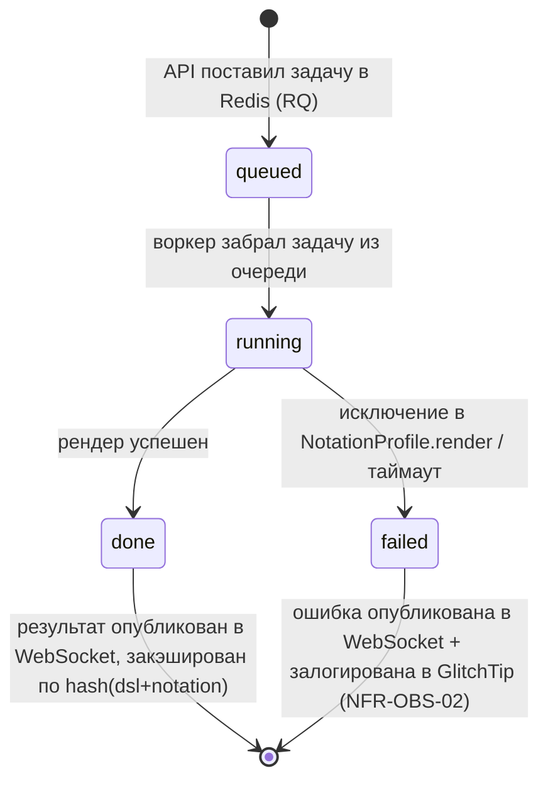
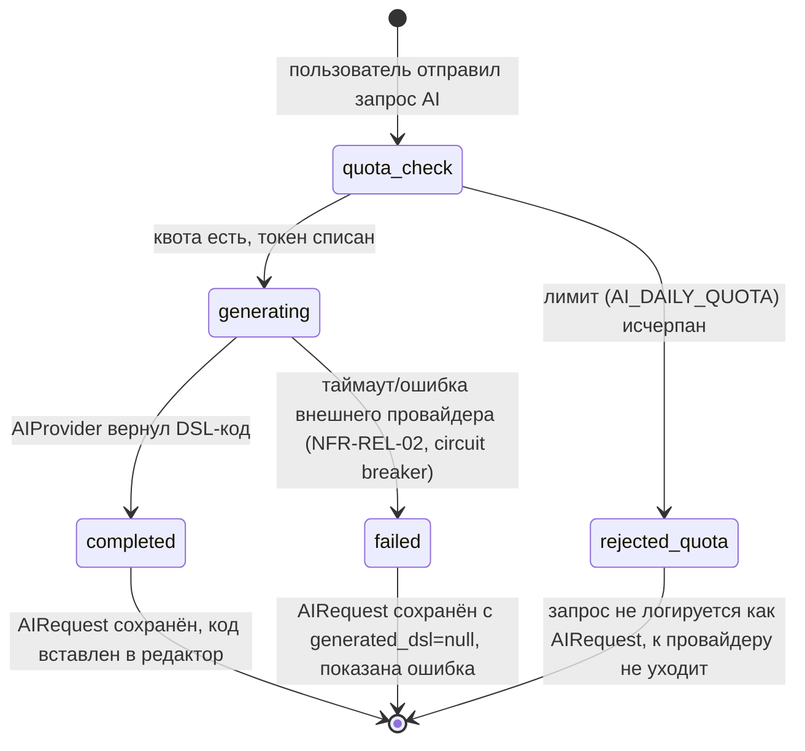
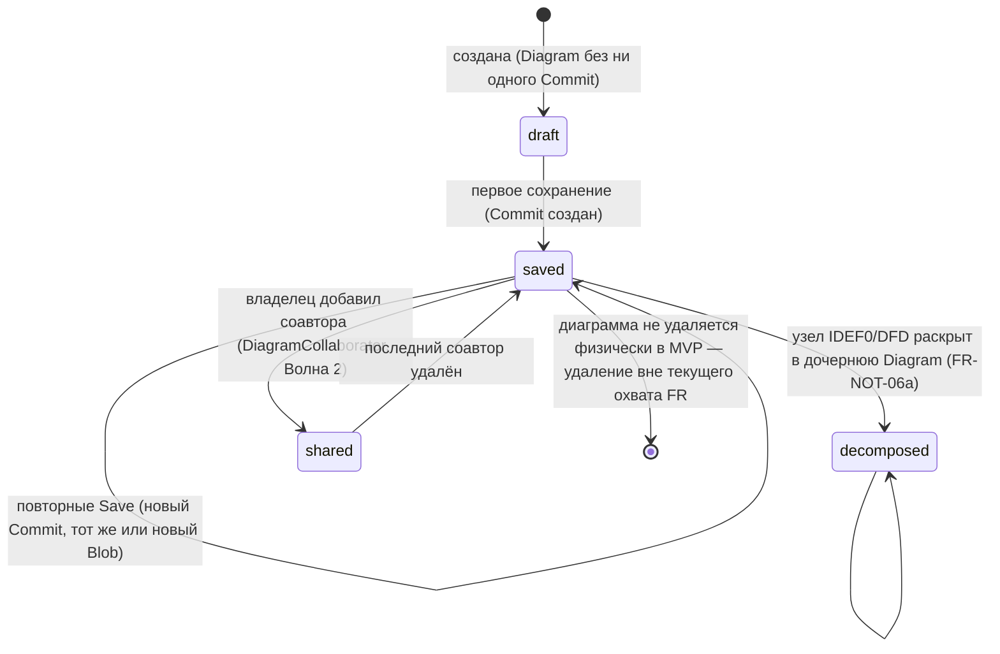
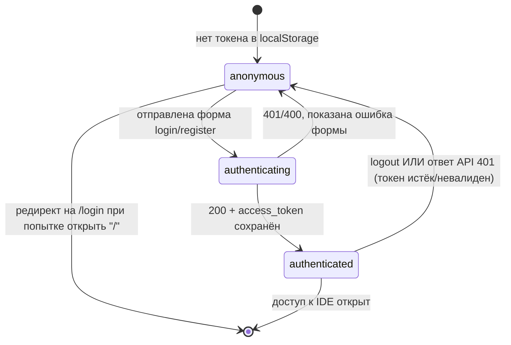

# Диаграммы состояний ключевых сущностей

**Статус:** актуально
**Связанные документы:** [`00-system-architecture.md`](00-system-architecture.md), [`03-sequence-diagrams.md`](03-sequence-diagrams.md).

## 1. Жизненный цикл задачи рендера (worker job, FR-REN-04)

## 2. Жизненный цикл AI-запроса (FR-AI-*, включая rate limit)

## 3. Жизненный цикл диаграммы (владение и версии)

## 4. Аутентификация клиента (фронтенд, FR-AUTH-02/05)

